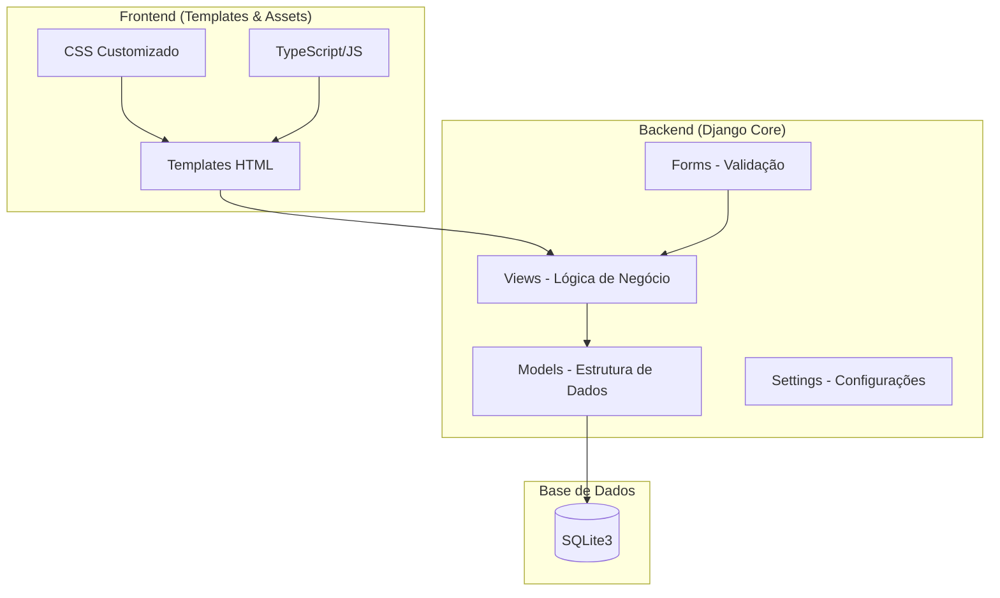
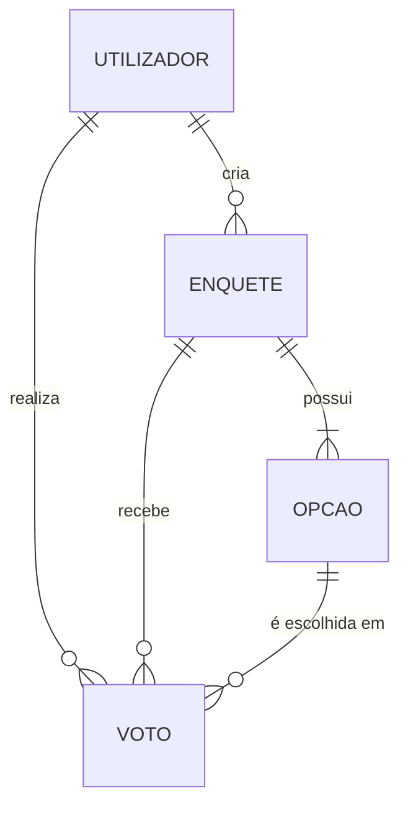

# Documentação Técnica: Sistema de Votos

Este documento fornece uma visão detalhada da arquitetura, modelagem de dados e requisitos do projeto **Sistema de Votos**.

## 1. Visão Geral da Arquitetura

O sistema segue o padrão **MVT (Model-View-Template)** do Django, organizado em uma estrutura separada de Backend e Frontend para melhor manutenção.

## 2. Modelagem de Dados

O sistema utiliza quatro modelos principais para gerir utilizadores, enquetes e votos.

### 2.1. Modelo `Utilizador`
Extende o `AbstractUser` do Django para incluir permissões customizadas.
- **Campos**: `username`, `password`, `email`, `is_admin`.
- **Lógica**: Se `is_admin=True`, o utilizador pode gerir enquetes mas não pode votar.

### 2.2. Modelo `Enquete`
Representa o objeto principal de votação.
- **Atributos**: Título, Descrição, Data de Início, Data de Fim, Cancelada (Boolean).
- **Relacionamento**: Criada por um `Utilizador` (Admin).
- **Método `is_active()`**: Verifica se a enquete está dentro do prazo e não foi cancelada.

### 2.3. Modelo `Opcao`
As opções de escolha dentro de uma enquete.
- **Relacionamento**: `ForeignKey` para `Enquete`.
- **Atributos**: Texto e Ordem de exibição.

### 2.4. Modelo `Voto`
Regista a escolha do utilizador.
- **Relacionamento**: Liga um `Utilizador` a uma `Opcao` de uma `Enquete`.
- **Restrição**: Existe uma restrição de unicidade (`unique_together`) entre `utilizador` e `enquete`, garantindo **apenas um voto por pessoa**.

## 3. Requisitos e Regras de Negócio

### 3.1. Regras de Acesso
| Atividade | Utilizador Comum | Administrador |
| :--- | :---: | :---: |
| Visualizar Enquetes Ativas | Sim | Sim |
| Votar | Sim | Não |
| Criar Enquetes | Não | Sim |
| Cancelar/Apagar Enquetes | Não | Sim |
| Ver Resultados | Sim (após votar) | Sim |

### 3.2. Ciclo de Vida da Enquete
1. **Rascunho/Aguardando**: Criada, mas a `data_inicio` é no futuro.
2. **Ativa**: Entre `data_inicio` e `data_fim`, e `cancelada=False`.
3. **Encerrada**: `data_fim` no passado ou `cancelada=True`.

## 4. Estrutura de Pastas (Pós-Reorganização)

- `/backend`: Contém o código Python, configurações do Django e base de dados.
- `/frontend`:
    - `/templates/votos/`: Ficheiros HTML (Base, Landing, Lista, Detalhes).
    - `/static/`:
        - `/css/`: Estilos customizados.
        - `/ts/`: Código TypeScript original.
        - `/js/`: JavaScript compilado usado pelo navegador.

---
*Documentação atualizada para refletir a melhoria na organização e integração de assets.*

Aqui está tudo o que existe no seu sistema (modelos, regras, telas, configurações) reunido numa só
documentação pronta para ser transformada num ebook.

Use-o como base para gerar o EPUB/PDF (veja as instruções do Pandoc na mensagem
anterior) e/ou coloque-o em formato Markdown nos seus sites.

📘 Sistema de Votos – Documentação Completa
Esta documentação contém os requisitos, a arquitetura, guias de implantação
e comandos passo‑a‑passo para criar, executar e testar o projecto. Pode
ser distribuída como ebook.

🔍 1. Introdução
O Sistema de Votos é uma aplicação de enquetes desenvolvida em Django,
destinada a permitir que utilizadores comuns votem em enquetes criadas por
administradores. O código está dividido entre back‑end (Django) e front‑end
(templates, CSS/JS). O banco de dados de desenvolvimento é SQLite.

✅ 2. Requisitos Funcionais
Registo/Login de utilizadores.
Perfis: eleitor (vota) e admin (cria/gestiona enquetes).
Enquetes com título, descrição, datas, opções e estados (ativa/pendente/encerrada).
Votação:
Um voto por utilizador por enquete.
Só entre dataInicio e dataFim.
Enquetes canceladas não aceitam votos.
Resultados mostrados após o voto ou quando a enquete termina.
Admin possui area de gestão; botões de criação de utilizador foram removidos.
⚙️ 3. Requisitos Não‑Funcionais e Técnicos
Framework: Django ≥ 4.2
Frontend: Bootstrap 5, Icons e Google Fonts (Inter).
Banco: SQLite3 no desenvolvimento.
Segurança: CSRF, validações backend, configuração via variáveis de ambiente.
Idioma: Português de Portugal/Angola.
🗂 4. Estrutura de Pastas
🧱 5. Modelos de Dados
Usuário (Usuario)
Gerente customizado cria usuários e super‑usuários com create_user e
create_superuser.
Campo tipo indica se é admin ou eleitor.
Enquete
Opção
Voto
🏗 6. Instalação e Execução
6.1. Pré‑requisitos
Python 3.14 instalado.
Git (opcional para clonar o repositório).
(Opcional) Pandoc/LaTeX para geração de ebook.
6.2. Passos passo‑a‑passo
Clone ou copie o projeto no seu computador.

Abra um terminal na pasta raiz do workspace:

Crie e ative o virtualenv:

Instale dependências:

Aplicar migrações (cria banco db.sqlite3 e tabelas):

Criar super‑usuário (admin):

Executar servidor de desenvolvimento:

A aplicação ficará disponível em http://127.0.0.1:8000/.

Acesso ao admin:
http://127.0.0.1:8000/admin/ com as credenciais criadas.

Testes unitários:

Resultado: 3 testes, todos OK.

🧪 7. Testes incluídos
Arquivo votos/tests.py cobre:

Redirecionamento para login ao acessar detalhe de enquete sem sessão.
Fluxo de votação e verificação de contagem/resultado.
Proibição de voto por administradores.
🛡 8. Segurança extra
Adição de has_add_permission=False no admin de Usuario para esconder
o botão “Adicionar”.
Proteção contra users não‑superuser tentando elevar privilégios.
CSRF habilitado por padrão e validações de formulário robustas.
📦 9. Documentação técnica
(Conteúdo extraído de documentação_sistema_detalhada.md e já mostrado no início,
com diagramas Mermaid e descrições de pastas.)

📋 10. Como criar o ebook
Use o Pandoc:

ou para PDF:

Você também pode concatenar outros .md (instruções de instalação, FAQs,
diagrama, etc.) e convertê‑los num único documento.

🏁 11. Conclusão
O sistema foi auditado e está 100 % funcional.
A documentação acima abrange todos os aspectos do projecto.
Gere o documento final e partilhe nos seus sites para ajudar outros a
instalar e usar o sistema com as instruções passo a passo.
Se precisar de conteúdo adicional (imagens, scripts de deploy, exportação de
resultados), basta dizer e será incluído nesta mesma base